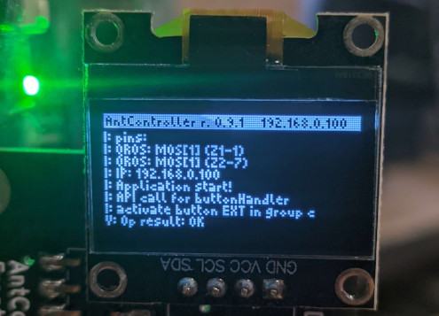
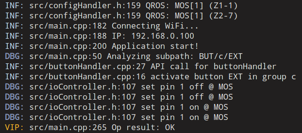

# Alfalog

For too long have I struggled with no legit arduino logging library.


## Features

* Formatted print
* Log levels (with colors!)
* Hexdump
* Adding several backends, with configurable verbosity
* Example of an advanced OLED backend, combining logging and other info


This library has been written with ESP32 family in mind, where ram is not that big of an issue. I'd not use it with low-end targets.

The fmtlib is used as a backend, which has not been written with embedded targets in mind.

## Using the library

See `/examples`

To use this library in your platformio project, add this to `platformio.ini`

```
lib_deps =
    [...]    
	  https://github.com/cr1tbit/alfalog#v1.0.0
```

For the basic serial printing, user must supply their own print handle, which can be as easy as:

``` c++
void uartPrintAlogHandle(const char* str){
  Serial.println(str);
}

SerialLogger serialLogger = SerialLogger(uartPrintAlogHandle, LOG_DEBUG, ALOG_FANCY);

void setup(){
  AlfaLogger.addBackend(&serialLogger);
  AlfaLogger.begin();
}
```

This also allows the user to log with more exotic targets:

``` c++
AsyncWebServer server(80);
AsyncEventSource events("/events");

server.addHandler(&events);

void socketAlogHandle(const char* str){
    events.send(str,"log",millis());
}

SerialLogger socketLogger = SerialLogger(socketAlogHandle, LOG_DEBUG);

void setup(){
  AlfaLogger.addBackend(&socketAlogHandle);
  AlfaLogger.begin();
}
```

## Writing custom backend

User can easily create their own target for logging (like a display, speaker screaming the logs, etc.)

All that's needed is to inherit from `AlfaBackend` class, overriding the construnctor and 2 methods:

``` c++
MyLogger(alog_level_t target_level, anything_else_t something);

void log(alog_level_t level, 
  const char* file, int line, 
  const std::string& msg);

void begin();
```

## Example usage

An example for custom logger can be seen in `advancedOledLogger.h` file.

 

On terminal:

 


## #undef B1

That's kinda funny. https://github.com/fmtlib/fmt/issues/3559